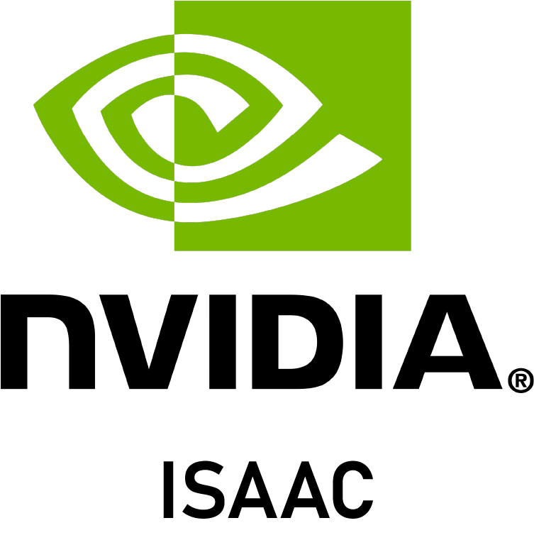
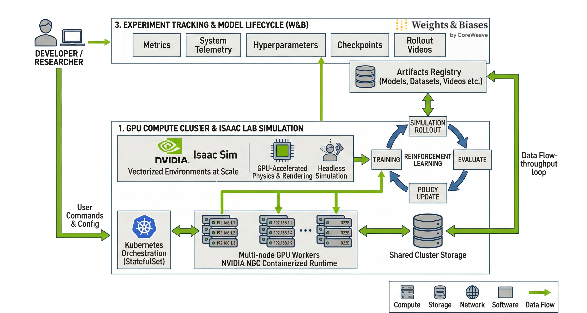

# NVIDIA Blueprint

## Reinforcement Learning in Isaac Lab with Weights & Biases

<p align="center">
  
  &nbsp;&nbsp;&nbsp;&nbsp;
  
  
</p>


## [Live Project: Isaac Lab + W&B on CoreWeave](https://wandb.ai/wandb-smle/isaaclab-wandb-crwv?nw=o1pb2dm0rfd)

Access the GitHub Repo here:
[GitHub Repository](https://github.com/anu-wandb/wb-nvidia-isaac-lab)

<p align="center">
  
</p>


## Overview

This blueprint demonstrates how robotics teams can scale reinforcement
learning (RL) experiments in NVIDIA Isaac Lab across multiple GPUs and
nodes, while unifying experiment tracking, artifact management, and
simulation logging using Weights & Biases (W&B), the AI Developer
platform.

It provides a production-ready reference architecture for:

-   Multi-node distributed RL
-   Headless Isaac Sim execution
-   Large-scale environment parallelization
-   Automated checkpoint tracking
-   Video logging for easily reproducible experiments

As the cluster scales horizontally, W&B provides a centralized and
persistent, reproducible control plane for experiment visibility,
comparison, registry workflows, and automation.

**Default task:**
`Isaac-Dexsuite-Kuka-Allegro-Lift-v0`

**Additional environments:**
[Isaac Lab Environment Overview](https://isaac-sim.github.io/IsaacLab/main/source/overview/environments.html)

---

## What You'll Build

A distributed RL training system that:

-   Scales Isaac Lab across multiple nodes
-   Runs thousands of parallel simulation environments
-   Synchronizes gradients across nodes
-   Automatically logs metrics and media
-   Maintains a fully reproducible experiment record

You can modify the cluster sizing to match your hardware.

---

## Key Capabilities

-   **Distributed RL at Scale** -- Multi-node GPU training
-   **High-Fidelity Robotics Simulation** -- RTX-accelerated physics
-   **Headless Cluster Execution** -- Containerized, Kubernetes-native
-   **Integrated Experiment Tracking** -- Metrics, media, and artifacts
    unified
-   **Automated Model Versioning** -- Checkpoint tracking and registry
    workflows
-   **Reproducible Workflows** -- Full configuration and lineage
    tracking
-   **Collaboration Across Teams** -- Reporting and Saved Views in W&B
    Workspaces

---

## Architecture

<p align="center">
  
</p>


This blueprint consists of three layers:

1.  **GPU Compute Cluster**
2.  **Simulation & RL Training Environment -- Isaac Lab**
3.  **Experiment Tracking Layer -- Weights & Biases**

The infrastructure details (node count, GPU type, cloud provider) are
abstracted. The system scales horizontally across GPU-backed worker
nodes.

We recommend using Ray Tracing (RTX) enabled NVIDIA GPUs like RTX 6000
Pro or L40 so your team can render simulations as videos alongside
training and rollout metrics.

---

## 1. GPU Compute Cluster

At the foundation is a GPU cluster providing scalable, distributed
compute for this reinforcement learning workload.

-   Multi-node GPU workers
-   Kubernetes orchestration (StatefulSet)
-   Shared persistent storage for checkpoints and logs
-   Containerized runtime via NVIDIA NGC

---

## 2. Isaac Lab Simulation & RL Layer

Running on top of the cluster, Isaac Lab, powered by NVIDIA Isaac Sim,
executes massively parallel robotics simulation and distributed policy
optimization.

-   Vectorized environments at scale
-   GPU-accelerated physics and rendering
-   Headless simulation
-   Multi-GPU training via `torch.distributed`

Isaac Sim generates trajectories across thousands of environments, which
feed directly into synchronized gradient updates across GPUs.

High-throughput training loop:

```
Simulation → Rollout Collection → Policy Update → Repeat
```

---

## 3. Experiment Tracking & Model Lifecycle (W&B)

All training outputs stream to Weights & Biases (W&B) as the integrated
experiment tracking layer.

W&B captures:

-   Metrics
-   System telemetry
-   Hyperparameters
-   Checkpoints
-   Rollout videos
-   Versioned artifacts
-   Model lineage

---

## ML Workflow

Training begins with massively parallel simulation inside Isaac Lab, where thousands of vectorized environments run per GPU. Isaac Sim executes headless, leveraging RTX rendering and GPU-accelerated physics to generate high-fidelity trajectories at scale.

These trajectories feed into a distributed RL optimizer using `torch.distributed`, synchronizing gradients across GPUs and nodes. Policies improve over hundreds or thousands of iterations as reward signals and system metrics evolve in real time.

Throughout training, metrics, hyperparameters, rollout videos, and checkpoints stream to Weights & Biases, creating a synchronized, reproducible system of record. This closed loop: simulate → optimize → evaluate → log—enables rapid iteration without sacrificing visibility or reproducibility.

---

## Why NVIDIA Isaac Sim + Isaac Lab

NVIDIA Isaac Sim delivers photorealistic, GPU-accelerated robotics simulation, while Isaac Lab adds scalable RL workflows and distributed training support, enabling high-fidelity RL training across GPUs and clusters.

---

## Why Weights & Biases (Experiment Tracking Layer)

Weights & Biases provides a unified experiment tracking layer for distributed RL - synchronizing metrics, simulation videos, checkpoints, and artifacts into a single reproducible record. It enables comparison across experiments and simulations, model lineage tracking, registry workflows, and automated alerts as training scales.

Simulations are auto-synced to training steps, helping teams connect the metrics to rollouts with a single pane of glass.

## Observability

Training is monitored centrally through Weights & Biases Workspace, where metrics, system telemetry, simulation videos, and checkpoints are visualized in real time. Teams can define alerts on key signals such as reward thresholds, loss divergence, or system utilization to proactively monitor training health as workloads scale.

Beyond live monitoring, W&B Reports (see example auto-generated report here) enable teams to create shareable, structured summaries of experiments, combining charts, rollout videos, configurations, and analysis in a single collaborative document. This makes it easy to review results, compare runs, communicate findings across teams, and maintain a durable record of research progress.

Together, dashboards, alerts, and reports provide continuous visibility from experiment execution to results dissemination.


## Live Experiment Example

[Isaac Lab + W&B on CoreWeave](https://wandb.ai/wandb-smle/isaaclab-wandb-crwv?nw=o1pb2dm0rfd)


## References

-   [Isaac Lab GitHub](https://github.com/isaac-sim/IsaacLab)
-   [Isaac Sim Documentation](https://docs.isaacsim.omniverse.nvidia.com/)
-   [Weights & Biases Documentation](https://docs.wandb.ai/)
-   [Kubernetes Documentation](https://kubernetes.io/docs/)
-   [NVIDIA NGC](https://catalog.ngc.nvidia.com/)
